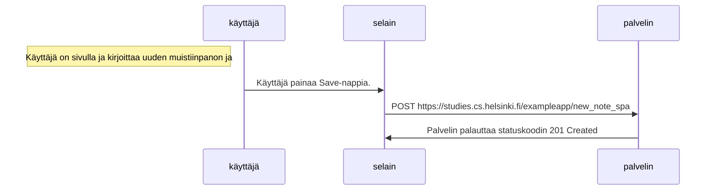

# Tehtävä 6

Tilanne: 
Käyttäjä luo uuden muistiinpanon single page ‑versiossa.

```mermaid
sequenceDiagram
    participant käyttäjä
    participant selain
    participant palvelin

    Note left of käyttäjä: Käyttäjä on sivulla ja kirjoittaa uuden muistiinpanon ja
    käyttäjä->>selain: Käyttäjä painaa Save-nappia.
    selain->>palvelin: POST https://studies.cs.helsinki.fi/exampleapp/new_note_spa
    palvelin->>selain: Palvelin palauttaa statuskoodin 201 Created
    
```
